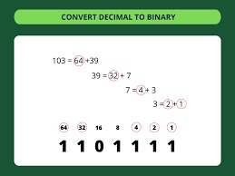
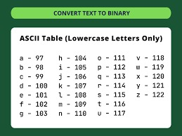

 - Binary → Letters (ASCII) – The Rule:

Each letter = 8 bits (1 byte)

### Example: 01000001 = A
If length % 8 ≠ 0 , add leading zeros to make it divisible by 8

Split binary into groups of 8 bits

Convert each group to decimal

Use ASCII table to match each decimal number to a character
 - Example:
Binary: 101001001001010010

Length = 18 → Add 6 zeros → 000000101001001001010010

Split:

00000010 = 2

10010010 = 146

01010010 = 82

Use ASCII:
2 → STX (control char)

146 → ’ (depends on encoding)

82 → R

Result: STX’R

### Simplified with pictures

